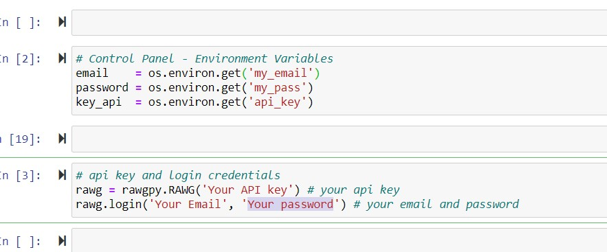

# RAWG Video Game Data

### Table of Contents
- [Description](#description)
- [Technologies](#Technologies)
- [Installation](#Installation)
- [References](#References)
- [Author Info.](#author-info)

## Description
According to (Vilnius, Lithuania) RAWG (RAWG.io) is a comprehensive database and a video game discovery service that lets players create and manage their multi-platform library in one place. RAWG reached its first milestone in product development field, by expanding its video game database over 245,000 game titles and becoming the largest multi-platform video game database in the world. This is an open project I'm working on. At the moment I don't have an analysis plane for the dataset. The reason for the project was to learn how to collect my own data. I've always been handed nice CSV files for my analysis, so I wanted to try and challenge myself by putting together a dataset on my own. Below is a list of technologies I used to get the data from RAWG's API.

## Technologies

- Python: is a free open sours high-level and general-purpose programming language commonly used from machine learning. However, for this project I used it to make API calls to extract data.

- Python Libraries: This is definitely not a comprehensive list of what a python library is. However, I've always thought of python libraries as a reusable chunk of code that automates a task for you. Most high level python libraries are built in languages like C++ or C. Python libraries in away are built on top of C++ or C and can communicate with the C code. Below are some python libraries I used for the project so far.

- A.) libraries
  - 1.) rawgpy
  - 2.) requests
  - 3.) pandas
  - 4.) numpy
  - 5.) json
  - 6.) os

## Installation
- This section I will briefly will walk you through some of the set up to help you to get access to RAWG's API and making your first API call.

###### 1.) python Installation
  - I used Anaconda for this project. Anaconda is an open sours toolkit that has many programming languages, open-source packages, and libraries nested in one for easy management. Here is a link to the Anaconda download page [Anaconda Instalation](https://www.anaconda.com/products/individual).  There are tons of good YouTube videos that will walk you through the Installation if you need a little more help. Fill free to contact me if needed. I have contact information in the Author Info. section

###### 2.) Making an account on RAWG.io
  - Fist you will need to create an account on RAWG.io here is a link to the website [RAWG.io](https://rawg.io/). Remember your account email and password You'll need it to sign in from python.

  - Next you will need to apply for your API credentials. Below are some steps on how to create the API credentials.
    - Once you have made an account, make sure your on the home page of RAWG. In the top right corner of the web page you will see a link call API. click the link!
    - Next, this will bring you to a new page. From here you'll see two white buttons "View The Documentation" and "Get an API Key". click Get an API Key!
    - You will be promoted to fill out some information and a brief explanation on why you are applying for the API key

- If my instruction were not helpful here are link to the direct web pages
  - [RAWG.io Home Page](https://rawg.io/)
  - [RAWG Database API](https://rawg.io/apidocs)
  - [RAWG Documentation](https://api.rawg.io/docs/)

## Side Note
- To keep my credentials privet I made Environment Variables to hiding my passwords, email, and API Keys. I'm on a Windows machine,s so the below video example may not be helpful if you don't have a Windows machine

  - [Making Environment Variables on Windows](https://www.youtube.com/watch?v=IolxqkL7cD8)

  - Here is a screen shot of the code to register your credentials from python!
  If you didn't make the environment variables you can skip that code and directly put your credentials into the functions.

## References
  - [Vilnius Lithuania's Quote](https://www.gamasutra.com/view/pressreleases/327935/RAWG_built_the_largest_video_game_database_and_you_can_edit_it.php#:~:text=October%204th%2C%202018%20%E2%80%94%20RAWG%20,platform%20library%20in%20one%20place.&text=Today%2C%20RAWG%20is%20rolling%20out,members%20willing%20to%20pitch%20in)

  - [Python Library Installation: rawgpy](https://pypi.org/project/rawgpy/)

## Author info
  - [My Linkedin Page](https://www.linkedin.com/in/samuel-bacon-49285316a/)
